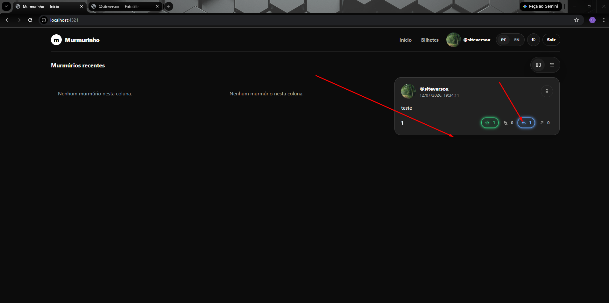

- imediatamente apos eu clicar na acao, ela fica estatica (correto) o hover é so para cards que nao interagi. mas se eu recarregar a pagina ele volta ao comprotamente normal  e esconde as acoes
- as acoes so aparecem no  hover do card, isto esta certo, mas no card que o usuario efetuou acoes eles podem aparecer sempre   
- to pensando numa forma de mostrar as ultimas repostas na home sem poluir, ate qts niveis qtd e utilizando componentes e logica que ja existe 