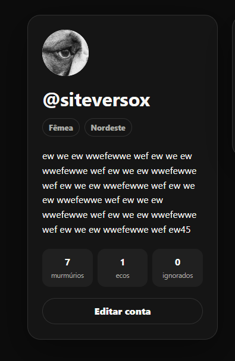
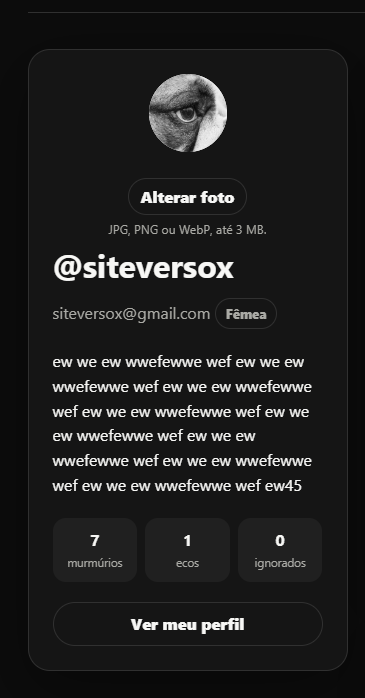

site-murm
Instrucoes

Voce pode ter a visao de conjunto antes
Mas Faca cada coisa de uma vez com cuidado e teste e nao duplique codigo
Vamos fazer uma alteracao por vez e eu vou confirmar uma por uma apois vc mandar o zip
Realize testes unitarios para garantir funcionamento

TODO, um de cada vez:

- verifique se tem arquivo lixo e me avisa aqui no chat se devo apagar algum arquivo
- Hoje o clique no usuario do topo abre a conta do usuario, vamos mudar isso  O clique no icone do usuario deve abrir o perfil dele que é o que todos veem
- E na esquerda deve ter a opcao para entao editar a conta
- permitir enviar imagem do perfil pela conta
- deve ter um pagina perfil da pessoa ao clicar no icone dela ou nome
- padronizar coluna esqueda com mesmo componente  mantendo detalhes da conta como sexo regiao embaixo o email etc usar mesmo componente unica direnca é que na conta da pra alterar a imagem