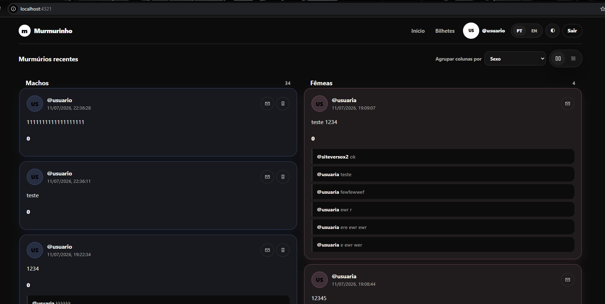

site-murm
Faca cada coisa de uma vez com cuidado e teste e nao duplique codigo
Se preferir vamos fazer uma alteracao por vez e eu confirma revisando para fazer a proxima
Mas voce pode ter a visao de conjunto antes

- rever todos os css se estao corretos e otimizados
- as repostas tb devem virar murmurios cards normais
- deve permitir alterar mensagem no chat
- deixar em  negrito so chats com novas mensagens na esquerda
- tirar o total de murmurios do topo das colunas da home
- o prorpeitario deve poder remover o murmurio
- 2 cliques no murmurio permite responder
- Mudar o icone do ignorar com  um fonte de ouvido
- Mostrar o icone de direct apenas no hover e mudar par um bilhetinho
- mostrar 3 colunas de cadastros sem sexo 