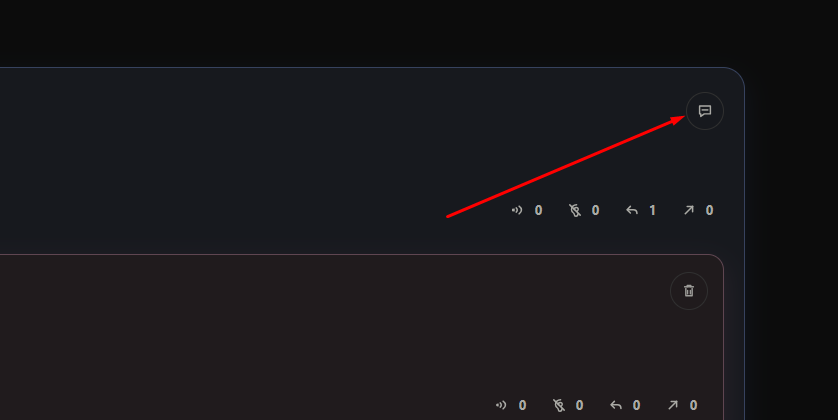
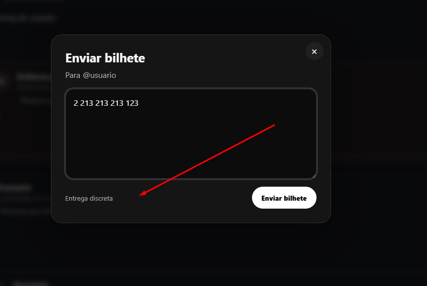

site-murm
Instrucoes

Voce pode ter a visao de conjunto antes
Mas Faca cada coisa de uma vez com cuidado e teste e nao duplique codigo
Vamos fazer uma alteracao por vez e eu vou confirmar uma por uma apois vc mandar o zip
Realize testes unitarios para garantir funcionamento

TODO, um de cada vez:

- dois cliques no murmurio ja abre pra responder, mais 2 cliques com a resposta aberta entra no perfil
- qd clicar aqui, ja por o foco no input
- aqui mostrar qts caracteres preenchido / total  