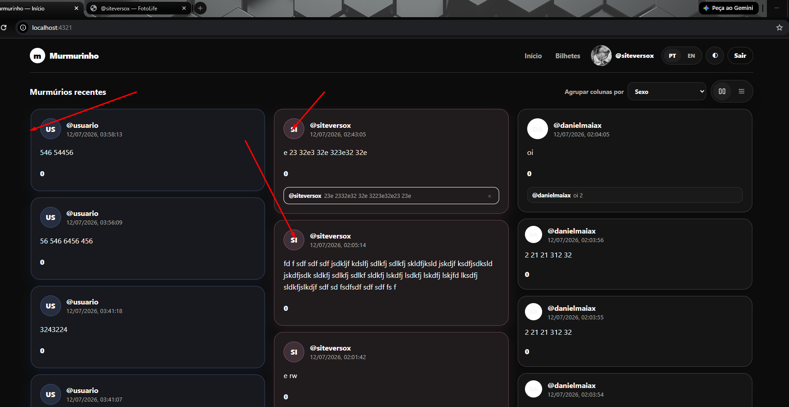
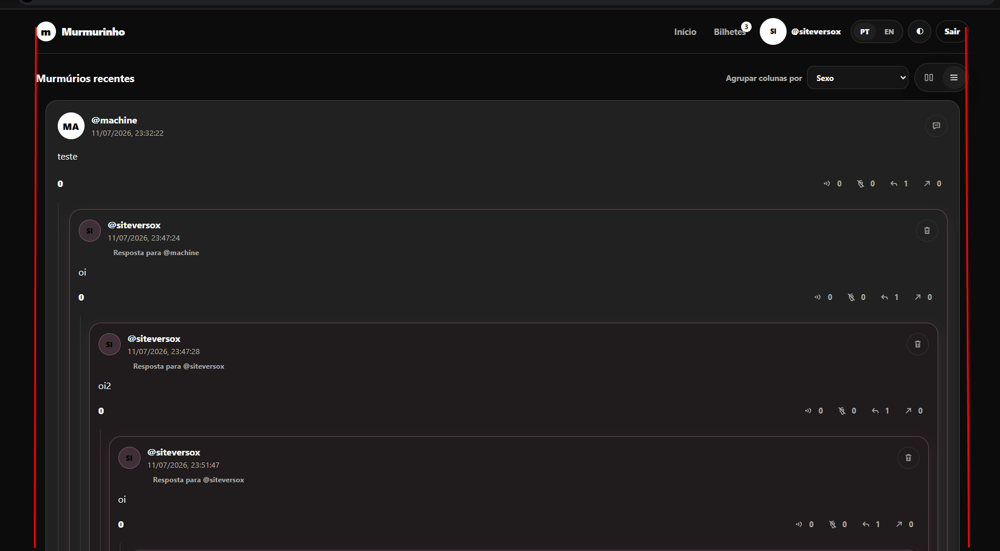

site-murm
Instrucoes

Voce pode ter a visao de conjunto antes
Mas Faca cada coisa de uma vez com cuidado e teste e nao duplique codigo
Vamos fazer uma alteracao por vez e eu vou confirmar uma por uma apois vc mandar o zip
Realize testes unitarios para garantir funcionamento

TODO, um de cada vez:
 
- [x] deve exibir imagem do perfil nos murmurios 
- [x] se a pessoa ecoou ou ocultou tem q deixar o icone da acao daquele card com efeito blur led ligado contorno 